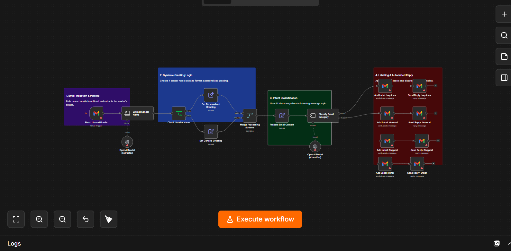

# b2b-email-classifier-n8n
Automated email classification and reply workflow using n8n, OpenAI, and Gmail.
# Gmail Auto-Responder & Intent Classifier (n8n)

An automated n8n workflow designed to handle incoming emails, classify their intent via OpenAI, and automatically organize/reply based on message categories.

## Overview
This pipeline monitors unread emails, parses sender data, formats context-aware greetings, and categorizes messages before taking action. 

It helps reduce manual inbox triage by classifying leads/support requests and sending automated initial replies.

## How It Works
1. **Fetch & Parse:** Polls unread messages from Gmail and extracts the sender's details.
2. **Dynamic Greeting:** Checks if a first name is present to switch between personal (`Dear [Name]`) and fallback (`Hello`) templates.
3. **Intent Classification:** Passes body text to OpenAI (`gpt-4o-mini`) to categorize the topic (Inquiries, Support, General).
4. **Action & Routing:** Applies designated Gmail labels and sends the corresponding reply template.

## Setup
1. Clone or copy `workflow.json` into your n8n instance.
2. Link your **Gmail OAuth2** and **OpenAI API** credentials.
3. Replace the placeholder label IDs (`YOUR_LABEL_ID_...`) in the Gmail nodes with your actual setup IDs.
4. Enable the workflow.
